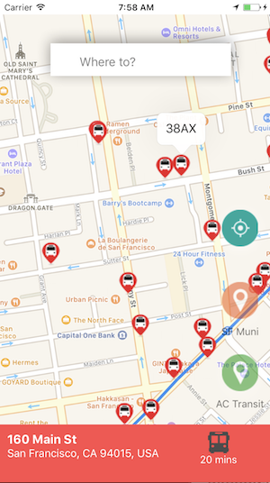
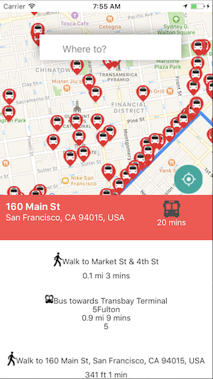

# transitninja

[Demo Page](https://noahskang.github.io/TransitNinja-Demo/)

## Overview
An iOS mobile app providing real time tracking of local public transit systems in the greater San Francisco bay area. Intended to provide public transit users a reliable app for finding optimal public transit routes based on current location and target destination. Users can also check to see if their route is on schedule, see current location of busses on the map, and can select a bus to see the route it is on.

## How to use transitninja
transitninja was designed to be as intuitive as possible for users. Although, here are a few tips to the app:
* Tap a bus to see that bus's route name



* Click on the search bar to open the keyboard and enter a destination to get the optimal route

* Tap the toggle buttons in the bottom right corner of the screen to toggle bus icons rendering to the map for the respective agencies (by default busses are rendered)
* Tap the icon above the toggles to reset the map to your current location


## Technologies

#### Backend
On the backend we used MongoDB for our database to store information pertaining to busses and transit agencies. We also used Node.js with a Express.js framework on the backend.

#### Frontend
Our frontend was created using React Native. We used Axios to make API calls to our backend to retrieve data from our database.

#### APIs
* 511.org - We made API calls to 511.org to retrieve information pertaining to realtime vehicle positions. These API calls were returned in GTFS-RT format, which is a language agnostic message system used in the transportation industry. We converted the results of these calls into javascript objects using NPM's GTFS-realtime Language Bindings library.

* Google Map Directions API - This API was used for the logic behind determining the optimal route for a user to take. An API call is sent when a user enters a destination in the search bar. This API was also used for providing the steps to get to the destination.

* Google Places API - Google Places API renders labels for street names, business names, etc. to the map.

#### Technical Challenges
* One significant challenge we encountered occurred in our backend while trying to send updated bus API data to the frontend. We had three asynchronous functions that were dependent on each other, and the function that posts our data into the database was executing prior to receiving the necessary data to send. We corrected this by associating a request-promise to the function it was dependent on so that it would wait until the prior function was executed.

```javascript

app.get('/api/actransitBusses', function(req, res) {
  actransitBussesModel.remove().exec();
  rp({
    method: 'GET',
    url: `https://api.511.org/transit/vehiclepositions?api_key=${apiArr[Math.floor(Math.random()*apiArr.length)]}&agency=actransit`,
    encoding: null
  }).then(function(arr){
    let array = GtfsRealtimeBindings.FeedMessage.decode(arr).entity;
    let actransitArr = [];
    array.forEach(function(entity) {
      if (actransitInfo[entity.vehicle.trip.trip_id]) {
      actransitArr.push({
        'id': entity.id,
        'trip_id': entity.vehicle.trip.trip_id,
        'lon': entity.vehicle.position.longitude,
        'lat': entity.vehicle.position.latitude,
        'stop_id': entity.vehicle.stop_id,
        'trip_headsign': actransitInfo[entity.vehicle.trip.trip_id].trip_headsign,
        "route_short_name": actransitInfo[entity.vehicle.trip.trip_id].route_short_name,
        "route_long_name": actransitInfo[entity.vehicle.trip.trip_id].route_long_name
        });
      }
    });
  actransitBussesModel.create(actransitArr, function(err, results){
    if (err) {
      return console.log(err);
    }
    res.send(actransitArr);
  });
});
});
```


* Another technical challenge was determining the best way to render the busses to the map. We decided to map each bus to a ```Mapview.Marker```, and set our state equal to an array of markers.

```javascript
makeAxiosRequests() {
    axios.get('https://transitninja.herokuapp.com/api/actransitBusses').then(response => {
      this.setState({ actransit_busses: response.data.map(bus => (
        <MapView.Marker
          coordinate={{
            latitude: bus.lat + 0.000060 || -36.82339,
            longitude: bus.lon || -73.03569
          }}
          title={bus.route_short_name}
          key={bus.id}
        >
          <Image source={BUS_LOGO_GREEN} />
        </MapView.Marker>
      )) });
    });
```


## Future Plans

We would like to add functionality to allow users to store favorite routes, and set up alerts that will notify the user if their route is running behind schedule. Additionally, add views that would allow users access to more information in regards to routes and stations. We hope to have this app on the Apple Store once we have added the aforementioned functionality.
