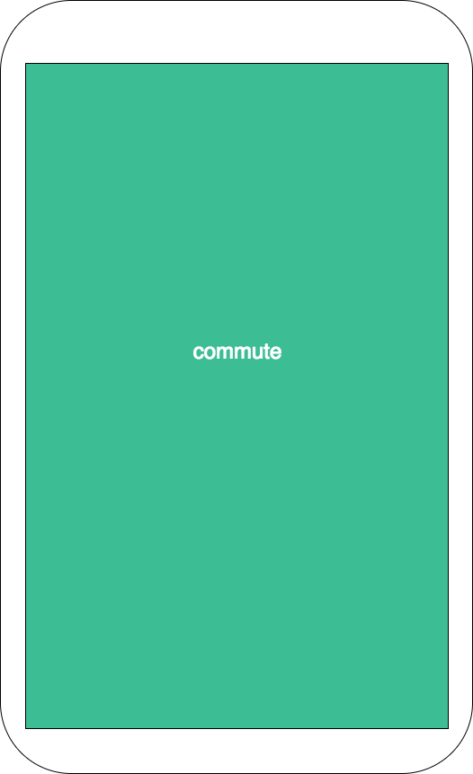
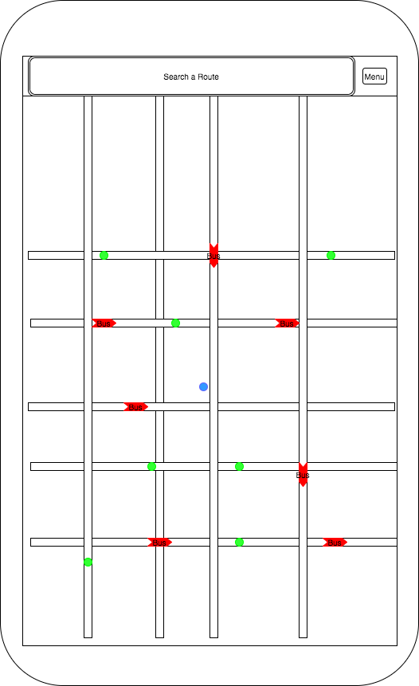
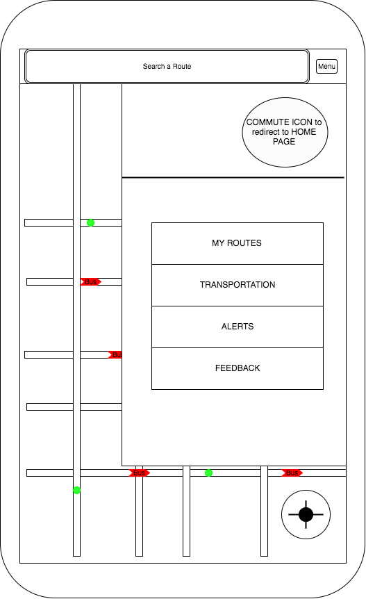
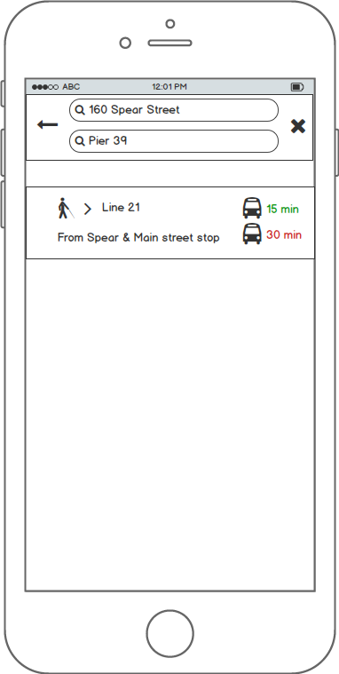
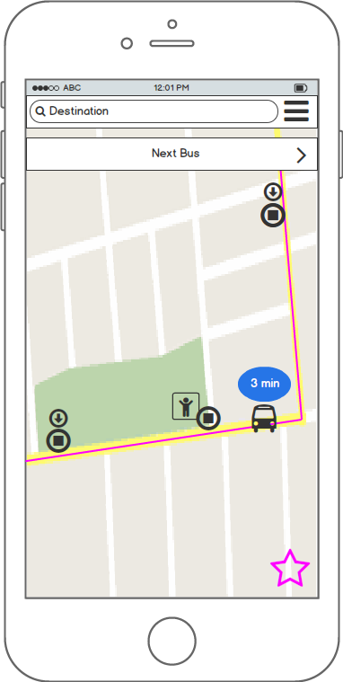
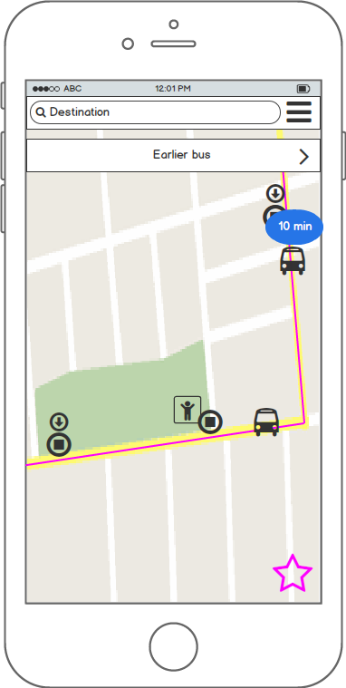
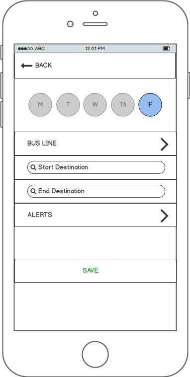

# Flex-Project Proposal

## Background and Overview
An iOS mobile app providing real time tracking of local public transit systems in the greater San Francisco bay area. Intended to provide public transit users a reliable app for finding optimal public transit routes based on current location and target destination. Users can also check to see if their route is on schedule, check current locations of vehicles, create favorite routes, and alert users if a favorite route is behind schedule.

## Functionality and MVP
* Real-time tracking of public transit vehicles
* Display vehicles on map
* Time estimates of routes
* User can input start point and end point
* Provides user optimal route to take

### Bonus Features
* Users can set “My Routes”
* Users will be alerted if their route is delayed

## Technologies and Technical Challenges
* JavaScript/Node.js
* PostgresQL
* React Native

### Challenges
* Ensuring that the data obtained from the API calls will be accurate and timely/verifying this
* Integrating Google Maps API to our route time calculations

## Things Accomplished Over the Weekend
* Successfully acquired tokens to make API calls for 511 and Bart, also tested API calls to verify ability to obtain information
* Covered a few tutorials on how to use and understand React Native and Node.js
* Installed Xcode on all of our computers and walked through Xcode
* Researched various phone apps for styling, single page app vs. multi view apps, UX/UI flaws, etc.

### Wireframes
Loading Page

Home Page

Modal Nav Bar

Route Options

Show Bus on Map

Next Bus

My Favorite Routes

New Favorite

## Group Members and Work Breakdown
	Josh Chen, Noah Kang, John Matthews, George Vuong

## Implementation Timeline

### Day 1: Day is dedicated to setting up each type of API call for relative feeds
https://code.google.com/archive/p/googletransitdatafeed/wikis/PublicFeeds.wiki

* Obtain data from API call, including real-time data.
* Google Maps API, (https://developers.google.com/maps/documentation/javascript/get-api-key)
* BART API, API Bart documentation (http://api.bart.gov/docs/overview/index.aspx), BART API Key: ZKZB-5NI5-9J6T-DWE9
* Caltrain API http://www.caltrain.com/developer.html
* SFMTA/SF Muni API General Transit Feed Specification (GTFS) route and schedule data (https://www.sfmta.com/about-sfmta/reports/gtfs-transit-data)
* Getting project/skeleton setup - JOSH
* Insheet styling/UI aspect - NOAH
* Begin setup of database and node.js - GEORGE

### Day 2:
* Calculate how to estimate current locations of buses - JOSH
* Set up database with stations, vehicles, routes, etc. - GEORGE
* Render google maps api for the main screen -NOAH

### Day 3:
* Create and structure containers and components - EVERYBODY
* Render stations on map - JOHN
* Render routes on map - NOAH

### Day 4:
* Search bar and user input for start/end location -GEORGE
* Parse information and return results based on user input - JOHN
* Improve UX

### Day 5:
* Finish up styling - NOAH
* Render buses, trains, and barts real-time -GEORGE
* Push to app store - JOHN
* Set up emulator since it is a mobile app - JOSH
* Get reviews and users - EVERYBODY
